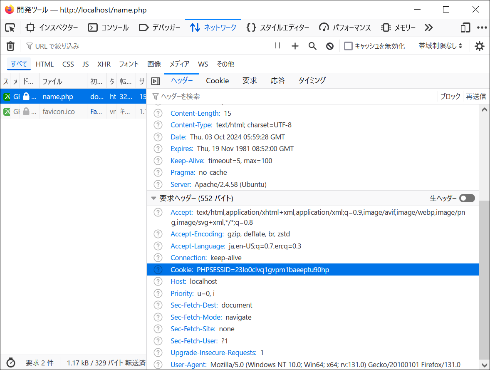
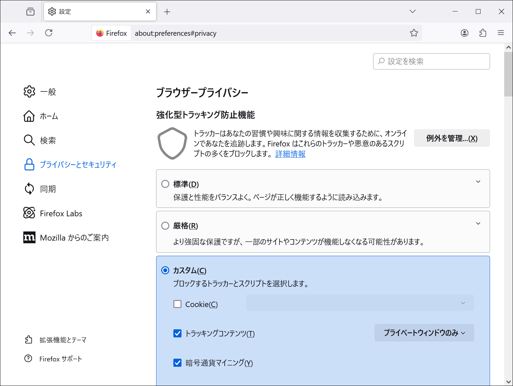
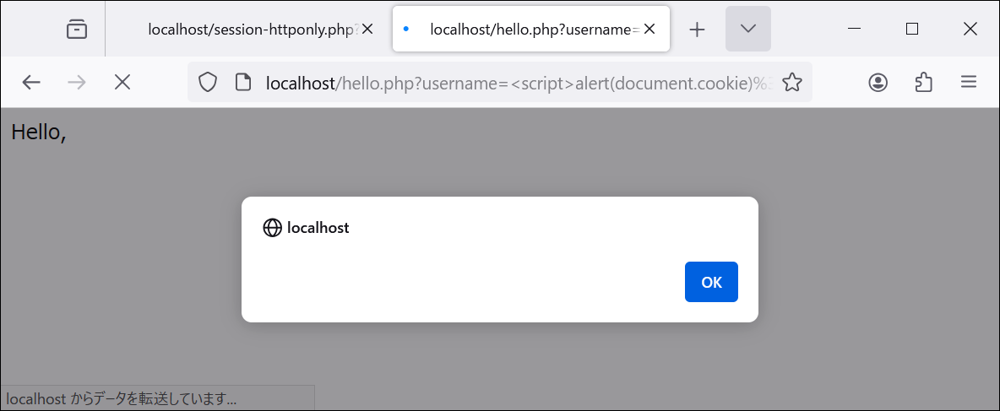
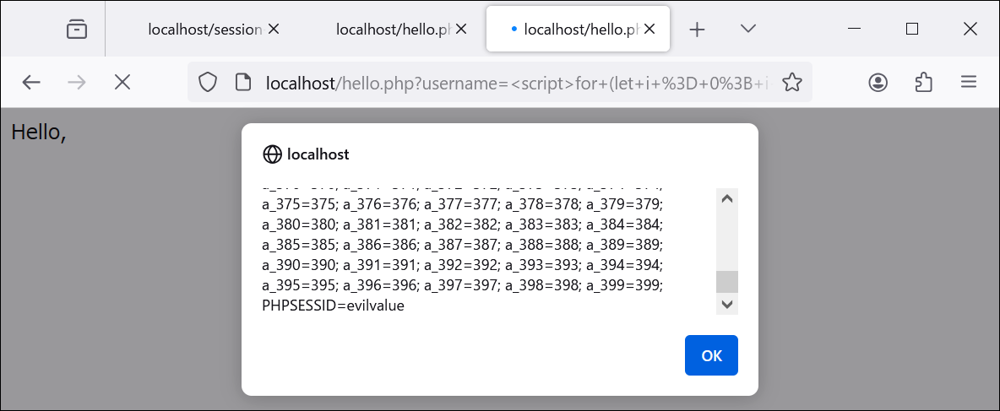

[← 第8章 Webアプリケーションの構築](08.md)

# Webアプリケーションのセキュリティ

## 前提知識

### アカウント

#### セッションとクッキー

[第7章](07.md)で構築した環境で動作するコードを使って説明する。

> [!IMPORTANT]
> 「送信された名前を記憶する」という例を使って，Webサーバがクライアントを識別できることを示す。

1. http://localhost/session.php?username=Yabuki にアクセスすると，「Hello, Yabuki.」と表示される。
2. 同じブラウザでhttp://localhost/name.php にアクセスすると，やはり「Hello, Yabuki.」と表示される。

[session.php](html/session.php)で，クエリの`username`の値をサーバサイドのセッションに記録し，同じブラウザでアクセスして，そのセッションを利用する。

Firefoxの**ウェブ開発ツール**，Chromeの**デベロッパーツール**等でネットワークの状況を確認すると，リクエストヘッダに「`Cookie: PHPSESSID=●●●`」という項目があり，リクエスト時にクライアントからサーバにクッキーが送信されていることがわかる（画像では●●●は`0g91q0uk37r8c66s05476uhrfa`）。



このクッキーがあれば，別のクライアントからでも同じセッションにアクセスできる。例えば，次のようにcURLを使ってアクセスすると，「Hello, Yabuki.」と表示される。

```bash
curl 'http://localhost/name.php' -H 'Cookie: PHPSESSID=●●●'
```

> [!TIP]
> 開発ツールやデベロッパーツールには，cURLでアクセスするためのコマンドをクリップボードにコピーする機能があり，これがブラウザの動作をコマンドで再現したい場合に便利である。

#### サードパーティクッキーとトラッキング

> [!IMPORTANT]
> サードパーティクッキーを使って，異なるドメインのウェブサイト間でユーザを追跡する。

サイト|ホスト|コンテンツ
--|--|--
Blog-A|ホストA（127.0.0.1）|[tracking.html](html/tracking.html)
SNS-B|ホストB（localhost）|[session-none.php](html/session-none.php), [good.php](html/good.php)

次のような状況を想定する。

1. 運営者の異なる二つのWebサイト，Blog-AとSNS-Bがある。
1. ブラウザはサードパーティクッキーを許可している。
1. Blog-Aのtracking.htmlには，SNS-Bの画像（good.php）が埋め込まれている。

2について，デフォルトで許可しているブラウザとそうでないブラウザがある。許可されていない場合は，画像のように許可してから実験する。



> [!TIP]
> [good.php](html/good.php)はSVGの画像を生成する。


> [!IMPORTANT]
> SNS-Bのユーザ（Yabuki）の，SNS-Bとは運営者の異なるBlog-Aでの行動が，SNS-Bのログに記録される。

1. SNS-Bのhttp://localhost/session-none.php?username=Taro にアクセスして，SNS-Bのクッキーを取得する。
2. Blog-Aのhttp://127.0.0.1/tracking.html に，同じブラウザでアクセスする。
3. シェルで`tail /var/log/apache2/error.log`を実行して，SNS-Bのログを確認する。

```
# tail /var/log/apache2/error.log
# ...
[Sat Sep 28 11:07:54.702307 2024] [php:notice] [pid 11847] [client 172.17.0.1:47396] Taro, referer: http://127.0.0.1/
```

このSNS-Bのログから，SNS-Bの管理者は，このSNSのユーザTaroがBlog-Aにアクセスしたことがわかる。

## Webアプリケーションの典型的な脆弱性

> [!CAUTION]
> ここで紹介する例は，自分で用意した実験用の環境でのみ試すべきである。

### XSS

> [!IMPORTANT]
> 第三者のスクリプトが実行できる状態のページの悪用例を示す。

1. 被害者がhttp://localhost/session.php?username=Yabuki にアクセスして，クッキーを取得する。
1. 被害者が，同じブラウザでhttp://localhost/hello.php?username=%3Cscript%3Ealert%28document.cookie%29%3B%3C%2Fscript%3E にアクセスすると，このページに埋め込まれたスクリプト（JavaScriptのコード）によって，クッキーが盗まれる。この例のURLは`http://localhost/hello.php?username=<script>alert(document.cookie);</script>`をパーセントエンコーディングしたものである（これはクッキーを表示するだけのものだが，[第8章](08.md)の方法で通信を行うことで，クッキーを盗める）。


#### 基本的な対策（特別な文字のエスケープ）

この問題は，[hello.php](html/hello.php)の代わりに[hello-safe.php](html/hello-safe.php)を使うと解決される。被害者が同様のURL，http://localhost/hello-safe.php?username=%3Cscript%3Ealert%28document.cookie%29%3B%3C%2Fscript%3E にアクセスしても，クッキーは盗まれない。


#### 保険的な対策1（CSP）

1. http://localhost/session.php?username=Yabuki にアクセスして，クッキーを取得する。
1. http://localhost/hello-csp.php?username=%3Cscript%3Ealert%28document.cookie%29%3B%3C%2Fscript%3E にアクセスしても，クッキーは盗まれない（[実装：hello-csp.php](html/hello-csp.php)）。


#### 保険的な対策2（HttpOnly属性）

> [!TIP]
> php.iniに「`session.cookie_httponly = On`」と記述することで，HttpOnly属性を付けることもできる。

1. http://localhost/session-httponly.php?username=Yabuki にアクセスして，HttpOnly属性の付いたクッキーを取得する（[実装：session-httponly.php](html/session-httponly.php)）。
2. http://localhost/hello.php?username=%3Cscript%3Ealert%28document.cookie%29%3B%3C%2Fscript%3E にアクセスしても，クッキーは盗まれない。



3. http://localhost/hello.php?username=%3Cscript%3E%5B...Array%28400%29.keys%28%29%5D.forEach%28%28i%29%3D%3E%7Bdocument.cookie%3D%60a_%24%7Bi%7D%3D%24%7Bi%7D%60%3B%7D%29%3Bdocument.cookie%3D%22PHPSESSID%3Devilvalue%22%3B%3C%2Fscript%3E でクッキーを大量にセットしてからなら，PHPSESSIDを上書きできる（セッション固定化攻撃）。



3のURLに埋め込んでいるスクリプトは次のとおり。

```javascript
[...Array(400).keys()].forEach((i) => {
  document.cookie = `a_${i}=${i}`;
});
document.cookie = "PHPSESSID=evilvalue";
```

### セッション固定化攻撃

> [!TIP]
> この実験をサポートするスクリプトを用意している（後述）。

1. 攻撃者が，「`curl -I http://localhost/session.php?username=XYZ`」でセッションを用意する（「`-I`」はレスポンスヘッダ表示のためのオプション）。

```
# curl -I http://localhost/session.php?username=XYZ
HTTP/1.1 200 OK
Date: Sun, 29 Sep 2024 05:53:29 GMT
Server: Apache/2.4.58 (Ubuntu)
Set-Cookie: PHPSESSID=ja2n40b6n9v994njbsmifbe18k; path=/
Expires: Thu, 19 Nov 1981 08:52:00 GMT
Cache-Control: no-store, no-cache, must-revalidate
Pragma: no-cache
Set-Cookie: PHPSESSID=deleted; expires=Thu, 01 Jan 1970 00:00:01 GMT; Max-Age=0; path=/
Set-Cookie: PHPSESSID=k68mua4qdnsd3a547m178reekr; path=/
Set-Cookie: PHPSESSID=m3vkgshugnjgqicqaklh4iiphd; path=/
Content-Type: text/html; charset=UTF-8
```

2. PHPSESSIDを●●●とする。上の例では●●●は`m3vkgshugnjgqicqaklh4iiphd`である（最後のもの）。
3. 被害者をhttp://localhost/hello.php?username=%3Cscript%3Edocument.cookie%3D%27PHPSESSID%3D●●●%27%3B%3C%2Fscript%3E にアクセスさせる。このURLは`http://localhost/hello.php?username=<script>document.cookie='PHPSESSID=●●●';</script>`をパーセントエンコーディングしたものである。（この段階では何も起こらない。）
4. 被害者がそのサイト上でhttp://localhost/session.php?username=Yabuki などの活動をする。この活動は，攻撃者が用意したセッションで行われる。
5. 攻撃者もそのセッションにアクセスすることで，被害者の活動を知ることができる。

```bash
# curl http://localhost/session.php -H 'Cookie: PHPSESSID=●●●'
Hello, XYZ*.
```

手順4がログイン（のようなもの）だとすると，この脆弱性の深刻さがわかる。

次のようにcreate-session.shをシェルで実行して，1行目の2行目のURLをブラウザで開き，3行目をシェルで実行する。

```bash
# sh /var/www/techappweb/07-09/create-session.sh
1. (browser) http://localhost/hello.php?username=%3Cscript%3Edocument.cookie%3D'PHPSESSID%3D●●●'%3B%3C%2Fscript%3E
2. (browser) http://localhost/session.php?username=Yabuki
3. (shell) curl http://localhost/session.php -H 'Cookie: PHPSESSID=●●●'

# 二つのURLにブラウザでアクセスしてから，3行目を実行する。
# curl http://localhost/session.php -H 'Cookie: PHPSESSID=●●●'
Hello, Yabuki.
```

### CSRF

> [!IMPORTANT]
> Blog-Aのページをを閲覧すると，Blog-Aとは無関係なSNS-Bを操作することになる。

サイト|ホスト|コンテンツ
--|--|--
Blog-A|ホストA（127.0.0.1）|[csrf.html](html/csrf.html)
SNS-B|ホストB（localhost）|[session-none.php](html/session-none.php), [session.php](html/session.php)

次のような状況を想定する。

- 運営者の異なる二つのWebサイト，Blog-AとSNS-Bがある。
- ブラウザはサードパーティクッキーを許可している。

1. 被害者が，SNS-Bのhttp://localhost/session-none.php?username=YABUKI にアクセスして，SNS-Bのクッキーを取得する。
1. 被害者が，SNS-Bのhttp://localhost/session.php に，同じブラウザでアクセスすると，「Hello, YABUKI.」と表示される。
1. 被害者が，Blog-Aのhttp://127.0.0.1/csrf.html に，同じブラウザでアクセスすると，ユーザ名が書き換えられてしまう。
1. 被害者が，SNS-Bのhttp://localhost/session.php に，同じブラウザでアクセスすると，「Hello, YABUKI.」ではなく，「Hello, ABC.」と表示される。

### SQLインジェクション

（第8章で作成した）次のファイルにはSQLインジェクション脆弱性がある。

- [SQLite: search-sqlite.php](html/search-sqlite.php)
- [MySQL: search-mysql.php](html/search-mysql.php)
- [共通部分: search.php](html/search.php)（脆弱な実装）

全ての商品が取得される。これはアプリの作成者が意図した動作ではない。

- SQLite: http://localhost/search-sqlite.php?search_name=%27+OR+TRUE+%2D%2D+
- MySQL: http://localhost/search-mysql.php?search_name=%27+OR+TRUE+%2D%2D+

SQLインジェクション脆弱性を修正した実装は次の通り。

- [SQLite: search-safe-sqlite.php](html/search-safe-sqlite.php)（SQLite独自の変更はない。）
- [MySQL: search-safe-mysql.php](html/search-safe-mysql.php)（プリペアドステートメントをMySQLで処理する。）
- [共通部分: search-safe.php](html/search-safe.php)（プリペアドステートメントを使用する。）

「全ての商品が取得される」ということはない。

- SQLite: http://localhost/search-safe-sqlite.php?search_name=%27+OR+TRUE+%2D%2D+
- MySQL: http://localhost/search-safe-mysql.php?search_name=%27+OR+TRUE+%2D%2D+

シェルで`tail /var/log/mysql/general.log`を実行して，MySQLにおけるプリペアドステートメントの処理を確認する。

```
# tail /var/log/mysql/general.log
# ...
2024-09-26T08:06:54.301423Z        24 Connect   testuser@localhost on mydb using TCP/IP
2024-09-26T08:06:54.302708Z        24 Prepare   SELECT * FROM items WHERE name LIKE ?
2024-09-26T08:06:54.302762Z        24 Execute   SELECT * FROM items WHERE name LIKE '%\' OR TRUE -- %'
2024-09-26T08:06:54.302960Z        24 Close stmt
2024-09-26T08:06:54.302973Z        24 Quit
```

[← 第8章 Webアプリケーションの構築](08.md)
