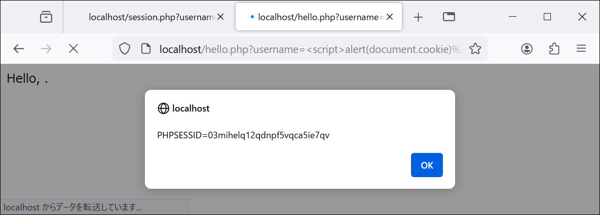

[← 第8章 Webアプリケーションの構築](08.md)

# Webアプリケーションのセキュリティ

## 前提知識

### HTTPS

### セッションとクッキー

#### セッション管理

[第7章](07.md)で構築した環境で動作するコードを使って説明する。

1. http://localhost/session.php?name=Yabuki にアクセスすると，「Hello, Yabuki.」と表示される。
1. 同じブラウザでhttp://localhost/session.php （`name=Yabuki`がないことに注意）にアクセスすると，やはり「Hello, Yabuki.」と表示される。

実装：[session.php](app/html/session.php)

Firefoxの**ウェブ開発ツール**，Chromeの**デベロッパーツール**等でネットワークの状況を確認すると，リクエストヘッダに「`Cookie: PHPSESSID=v5v0g3lpns70m0sq1c1ckcsak7`」という項目があり，リクエスト時にクライアントからサーバにクッキーが送信されていることがわかる。


このクッキーがあれば，別のクライアントからでも同じセッションにアクセスできる。例えば，次のようにcURLを使ってアクセスすると，「Hello, Yabuki.」と表示される。

```bash
curl 'http://localhost/session.php' \
-H 'Cookie: PHPSESSID=v5v0g3lpns70m0sq1c1ckcsak7'
```

> [!TIP]
> 開発ツールやデベロッパーツールには，cURLでアクセスするためのコマンドをクリップボードにコピーする機能があり，これがブラウザの動作をコマンドで再現したい場合に便利である。

#### クッキーによるユーザの追跡

運営者の異なる二つのウェブサイトがある。

サイト|URL|内容
--|--|--
ウェブサイトA|http://localhost:3000|個人ブログ
ウェブサイトB|http://localhost|SNS

1. ウェブサイトAのためのWebサーバAを起動する。

```bash
php -S 0.0.0.0:3000 -t /root/host/techappweb/07-09/app
```

2. ウェブサイトBのhttp://localhost/session.php?name=Yabuki にアクセスする。
3. ウェブサイトAのhttp://localhost:3000/tracking.html にアクセスする。（ページ中の画像はウェブサイトBのhttp://localhost/good.php である。）


4. Ctrl-Cで実験用のWebサーバAを停止させる。

ウェブサイトBのログには，このユーザがウェブサイトAにアクセスしたことが記録される。実際，「`tail /var/log/apache2/error.log`」とすると，次のような記録が確認できる。

```
[Tue Oct 31 11:12:21.726166 2023] [php:notice] [pid 11192] [client 172.17.0.1:46666] Yabuki, referer: http://localhost:3000/
```

このようにウェブサイトBは，ウェブサイトBのクッキーをもつユーザのウェブでの行動を追跡できることがある。

## 開発者側が注意すべきこと

> [!CAUTION]
> ここで紹介する例は，自分で用意した実験用の環境でのみ試すべきである。

### CSRF

実装：[session.php](app/html/session.php), [csrf.html](app/csrf.html)

1. 実験用のウェブサーバを起動する。

```bash
php -S 0.0.0.0:3000 -t /root/host/techappweb/07-09/app
```

2. 被害者がhttp://localhost/session.php?name=Yabuki にアクセスすると，「Hello, Yabuki.」と表示される。
3. 被害者が別ドメインのhttp://localhost:3000/csrf.html にアクセスする。
4. 被害者がhttp://localhost/session.php にアクセスすると，「Hello, Yabuki.」ではなく，「Hello, XYZ.」と表示される。

### XSS

実装：[session.php](app/html/session.php), [hello.html](app/html/hello.php), [hello-safe.php](app/html/hello-safe.php)

1. 被害者がhttp://localhost/session.php?name=Yabuki にアクセスする。
1. 被害者がhttp://localhost/hello.php?name=%3Cscript%3Ealert%28document.cookie%29%3B%3C%2Fscript%3E にアクセスすると，このページに埋め込まれたスクリプト（JavaScriptのコード）によって，クッキーが盗まれる。



この問題は，hello.phpの代わりにhello-safe.phpを使うと解決される。被害者がhttp://localhost/hello-safe.php?name=%3Cscript%3Ealert%28document.cookie%29%3B%3C%2Fscript%3E にアクセスしても，クッキーは盗まれない。


### セッション固定化攻撃

実装：[session.php](app/html/session.php), [session-safe.php](app/html/session-safe.php)

1. 攻撃者がセッションを用意する（オプション「`-I`」でレスポンスヘッダを表示する。ここでは，`Set-Cookie: PHPSESSID=780en1mmfkb64a4clrdjptar12`とする）。

```bash
curl -I http://localhost/session.php?name=XYZ
```

2. 被害者をhttp://localhost/hello.php?name=%3Cscript%3Edocument.cookie%3D%27PHPSESSID%3D780en1mmfkb64a4clrdjptar12%27%3B%3C%2Fscript%3E にアクセスさせる（他の方法を使ってもよい）。
3. 被害者がそのサイト上でhttp://localhost/session.php?name=Yabuki などの活動をする。この活動は，攻撃者が用意したセッションで行われる。
4. 攻撃者もそのセッションにアクセスすることで，被害者の活動を知ることができる（結果は「Hello, Yabuki.」）。

```bash
curl http://localhost/session.php \
-H 'Cookie: PHPSESSID=780en1mmfkb64a4clrdjptar12'
```

この問題は，session.phpの代わりにsession-safe.phpを使うようにすると解決される。被害者がhttp://localhost/session-sage.php?name=Alice などの活動をすると，攻撃者が用意したセッションは使えなくなり，攻撃者が被害者の活動について知ることはできなくなる。

### SQLインジェクション

[脆弱な実装](app/html/search.php)

全ての商品が取得される。これはアプリの作成者が意図した動作ではない。

- SQLite: http://localhost/search-sqlite.php?search_name=%27+OR+TRUE+%2D%2D+
- MySQL: http://localhost/search-mysql.php?search_name=%27+OR+TRUE+%2D%2D+

[修正した実装](app/html/search-safe.php)

- SQLite: http://localhost/search-safe-sqlite.php?search_name=%27+OR+TRUE+%2D%2D+
- MySQL: http://localhost/search-safe-mysql.php?search_name=%27+OR+TRUE+%2D%2D+

## 利用者が注意すべきこと

[← 第8章 Webアプリケーションの構築](08.md)